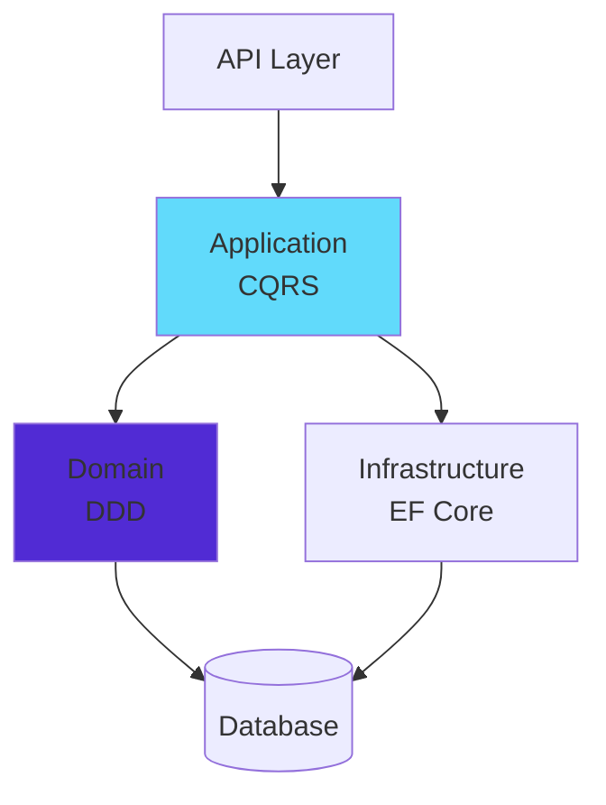
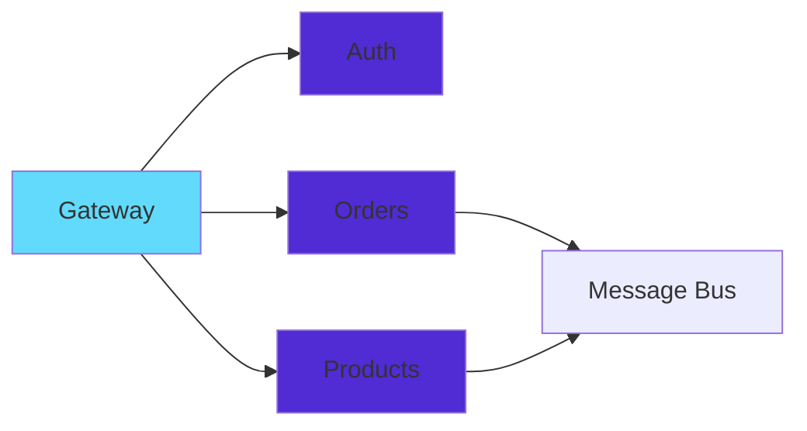

# 🌌 Welcome to the Digital Forge of Room67

<div align="center">


```ascii
╔══════════════════════════════════════════════════════════════╗
║                                                              ║
║   ██████╗  ██████╗  ██████╗ ███╗   ███╗    ██████╗ ███████╗ ║
║   ██╔══██╗██╔═══██╗██╔═══██╗████╗ ████║    ██╔════╝ ╚════██║ ║
║   ██████╔╝██║   ██║██║   ██║██╔████╔██║    ███████╗     ██╔╝ ║
║   ██╔══██╗██║   ██║██║   ██║██║╚██╔╝██║    ██╔═══██╗   ██╔╝  ║
║   ██║  ██║╚██████╔╝╚██████╔╝██║ ╚═╝ ██║    ╚██████╔╝   ██║   ║
║   ╚═╝  ╚═╝ ╚═════╝  ╚═════╝ ╚═╝     ╚═╝     ╚═════╝    ╚═╝   ║
║                                                              ║
╚══════════════════════════════════════════════════════════════╝
```

<p align="center">
  
</p>

<p>
  
  
  
  
</p>

</div>

---

## 🎯 The Architect's Creed

<div align="center">


> *"In the sacred realm of software architecture, where **Clean Code** meets **Domain-Driven Design**, I sculpt maintainable, scalable, and elegant solutions that transcend the ordinary."*

**🏗️ Software Architect** | **💻 Full-Stack Developer** | **📊 Data Scientist** | **🤖 AI Engineer**

Currently mastering the craft at **🎓 ENSA Safi** — where patterns emerge and systems evolve.

</div>

---

## 🏛️ Architectural Philosophy

<div align="center">

### 🎨 Mastering Enterprise Patterns

<table>
<tr>
<td align="center" width="20%">
<br/>
<b>🏛️ Clean Architecture</b><br/>
<sub>Independence & Testability</sub>
</td>
<td align="center" width="20%">
<br/>
<b>🧅 Onion Architecture</b><br/>
<sub>Layered Design</sub>
</td>
<td align="center" width="20%">
<br/>
<b>⬡ Hexagonal</b><br/>
<sub>Ports & Adapters</sub>
</td>
<td align="center" width="20%">
<br/>
<b>🎯 DDD</b><br/>
<sub>Domain-Driven Design</sub>
</td>
<td align="center" width="20%">
<br/>
<b>⚡ CQRS</b><br/>
<sub>Command Query Separation</sub>
</td>
</tr>
</table>

</div>

---

## ⚡ Technology Arsenal

### 🏆 Backend Excellence

<div align="center">

<table>
<tr>
<td align="center" width="50%">

<br/>

#### 💎 .NET Ecosystem (Primary Expertise)


**Core Expertise:** Building enterprise-grade applications with **Clean Architecture**, **DDD**, and **CQRS** patterns. Specialized in ASP.NET Core Web APIs, Entity Framework Core, MediatR pipeline, Blazor WebAssembly/Server, SignalR real-time communications, and microservices architecture with distributed systems.

</td>
<td align="center" width="50%">

<br/>

#### ☕ Spring Ecosystem


Proficient in Spring Boot microservices, Spring Data JPA, Spring Security, Hibernate ORM, and building scalable RESTful APIs with layered architecture and dependency injection.

</td>
</tr>
</table>

#### 🚀 Additional Backend Technologies


</div>

---

### 🎨 Frontend Mastery

<div align="center">

<table>
<tr>
<td align="center" width="33%">
<br/>


<b>Angular</b><br/>
<sub>Enterprise SPAs with TypeScript, RxJS & NgRx</sub>
</td>
<td align="center" width="33%">
<br/>


<b>React</b><br/>
<sub>Modern UIs with Hooks, Redux & Next.js</sub>
</td>
<td align="center" width="33%">
<br/>


<b>Blazor</b><br/>
<sub>Full-Stack C# with WebAssembly & Server</sub>
</td>
</tr>
</table>

#### 🎯 Frontend Technologies & Tools


</div>

---

### 💻 Programming Languages

<div align="center">


</div>

---

### 🗄️ Databases & Data Management

<div align="center">

#### 📊 Relational Databases


#### 📦 NoSQL & Caching


</div>

---

### ☁️ Cloud, DevOps & Tools

<div align="center">

#### ☁️ Cloud & Containerization


#### 🔧 Version Control & API Testing


#### 💼 Development Environments


#### 🖥️ Operating Systems


</div>

---

### 🤖 AI & Data Science

<div align="center">


</div>

---

### 🛠️ Additional Tools

<div align="center">


</div>

---

## 🏗️ Architectural Blueprints

<div align="center">


### 🎯 Core Architecture Patterns



### ⚡ Microservices Ecosystem



</div>

---

## 📊 GitHub Analytics

<div align="center">


### 🏆 GitHub Trophies


</div>

---

## 🔗 Connect & Collaborate

<div align="center">


<a href="https://www.linkedin.com/in/oussama-nouhar-3156132aa">
  
</a>
<a href="https://github.com/Oussamaroom67">
  
</a>

### 💬 Let's Architect Something Extraordinary Together!

*Open for collaboration on enterprise-grade projects, microservices architecture, and innovative solutions.*

</div>

---

## 🔥 Philosophy

<div align="center">


> **"Clean Code is not written by following rules alone — it emerges from a deep understanding of domain, design, and discipline."**

**💎 Code Quality Over Quantity** • **🏛️ Architecture Before Implementation** • **🧪 Test-Driven by Design**

**📚 Domain Knowledge First** • **🔄 Refactor Ruthlessly** • **🚀 Deploy Confidently**

</div>

---

## 🐍 Contribution Snake

<div align="center">

<picture>
  <source media="(prefers-color-scheme: dark)" srcset="https://raw.githubusercontent.com/Oussamaroom67/Oussamaroom67/output/github-snake-dark.svg" />
  <source media="(prefers-color-scheme: light)" srcset="https://raw.githubusercontent.com/Oussamaroom67/Oussamaroom67/output/github-snake.svg" />
  
</picture>

</div>

---

<div align="center">


### 🌟 *"In Room 67, we don't just write code — we architect solutions that stand the test of time."*


**⭐ Star my repositories if you find them valuable! ⭐**

</div>
